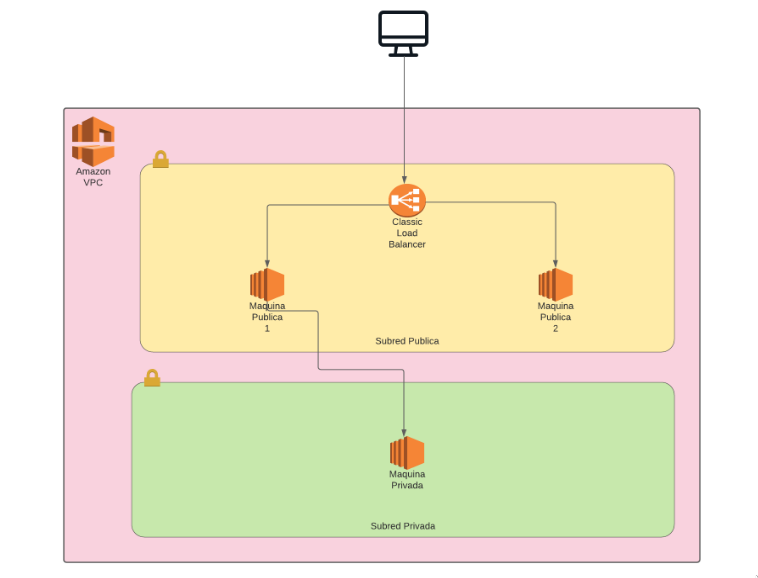

# Practica 5
## Arquitectura

## Balanceador de Carga

## VPCs
Una VPC es la implementación de AWS de una red. Tal como una red real, esta puede ser pública o privada. Una VPC puede segmentarse
una o más subredes.

### VPC pública
Se configuró una VPC pública donde se alojan dos máquinas virtuales que sirven la página web principal por medio de un balanceador
de carga, tal como se muestra en el diagrama de la arquitectura propuesta.

### VPC privada
Esta VPC es privada y solamente puede ser accedida desde otros servicios de AWS en la misma VPC. Esta subred aloja una única máquina
virtual que contiene un simple archivo de texto. Para conectarse a esta máquina solo será posible desde una de las máquinas virtuales
de la VPC pública.
